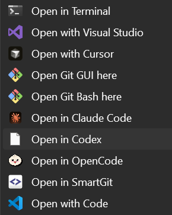

# CodexContextMenu

Windows context menu installer for Codex.



## Install
```powershell
powershell -ExecutionPolicy Bypass -Command "irm https://raw.githubusercontent.com/bariskisir/CodexContextMenu/master/install.ps1 | iex"
```

## Uninstall
```powershell
powershell -ExecutionPolicy Bypass -Command "irm https://raw.githubusercontent.com/bariskisir/CodexContextMenu/master/uninstall.ps1 | iex"
```
